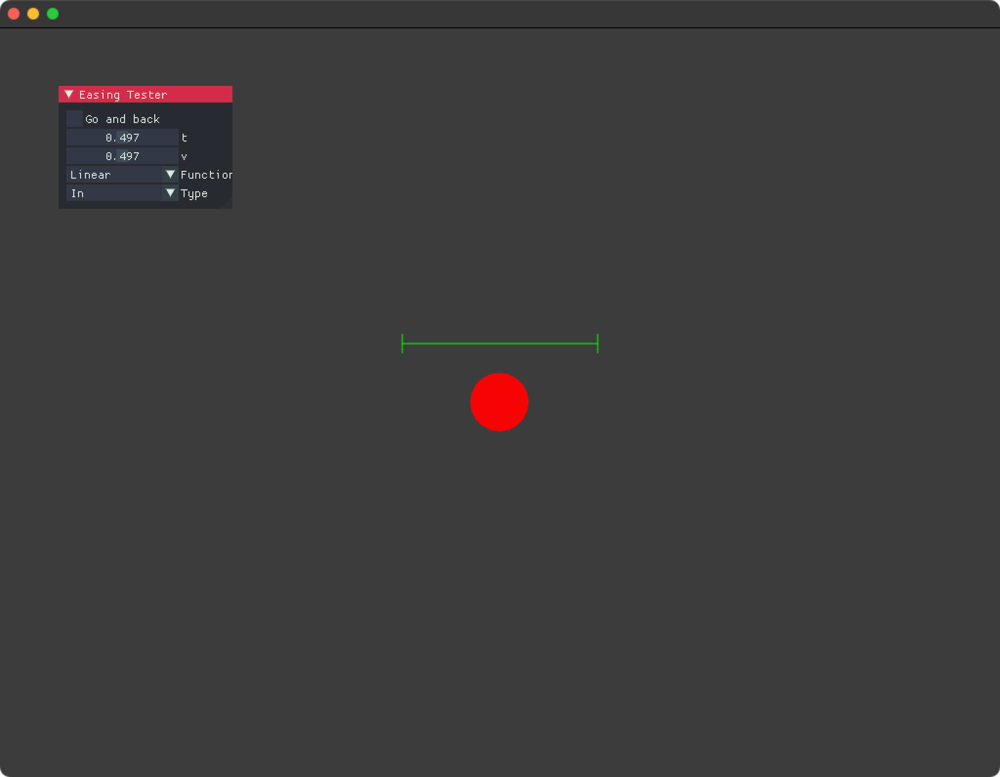
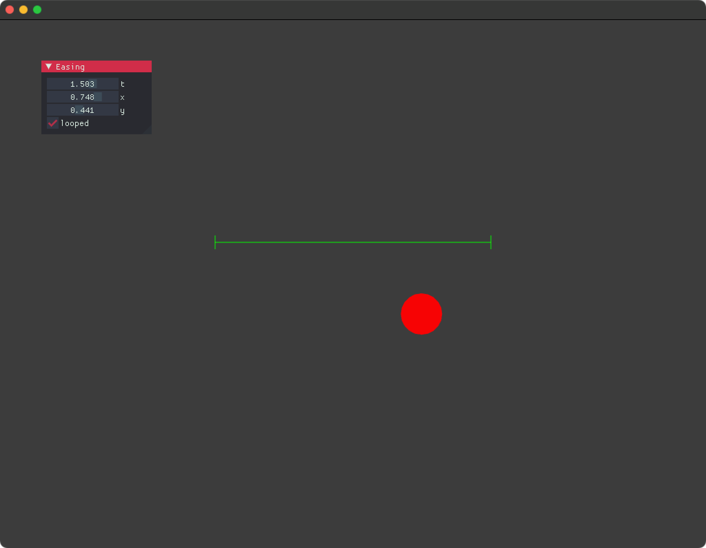

# ofxTimelineLoader

Data loader for ofxTimeline ( [original](https://github.com/YCAMInterlab/ofxTimeline) / [my fork](https://github.com/funatsufumiya/ofxTimeline) ) but also provide scriptable interface. This addon works ***without ofxTimeline***. Using ofxTimeline as an timeline editor is an **option**.

(C++/oF port of [timeline_rs](https://github.com/funatsufumiya/timeline_rs))

### ofxTimeline as an timeline editor (option)

- For easy use of ofxTimeline as an editor, I'll recommend [loaf_timeline](https://github.com/funatsufumiya/loaf_timeline). It can be used like Love2D, even without oF.

## Dependencies

- ofxEasing: https://github.com/arturoc/ofxEasing/
    - NOTE: this makes problems on windows build, so please use https://github.com/funatsufumiya/ofxEasing/ instead on windows.

## Examples

### [Easing Tester](./easing_tester/src/ofApp.cpp)

NOTE: This is just ofxEasing tester, but useful.



### [Timeline Simple](./example_simple/src/ofApp.cpp)

Timeline constructing by script. 

If you want to use this addon as a standalone lib ***without ofxTimeline data***, this example would be helpful.



```cpp
timeline = std::make_shared<Timeline>();

Track<float> tx;
tx.keyframes.push_back({std::chrono::milliseconds(0), 0.0f, ofxeasing::Function::Cubic, ofxeasing::Type::In});
tx.keyframes.push_back({std::chrono::milliseconds(1000), 1.0f, ofxeasing::Function::Cubic, ofxeasing::Type::Out});
tx.keyframes.push_back({std::chrono::milliseconds(2000), 0.0f, ofxeasing::Function::Cubic, ofxeasing::Type::In});
timeline->add<float>("x", tx);

// ...

x = timelineData.timeline->get_value<float>("x", std::chrono::milliseconds((int)t_ms))
```

### [Timeline From XML](./example_xml/src/ofApp.cpp)

XML parsing example


## Dev notes

- Portation from [timeline_rs](https://github.com/funatsufumiya/timeline_rs) was mostly done with GitHub Copilot. Already tested, but use with care.

## License

WTFPL or 0BSD
